# Awesome Gain Maps

Links, papers, discussion threads, [example images](https://github.com/NMoroney/awesome-gain-maps/tree/main/images) and libraries related to HDR using gain mapped JPEGs. This repository started as a collection of links and papers about color HDR. Then after CIC32 it accumulated applications and images from a parallel 30 day challenge on gain maps. Now it's a combination of these threads, a work in progress and a range of samples including photography, video games, visualization and test targets.

| Examples | | [More Examples & Attributions](images) |
| --- | --- | --- |
| 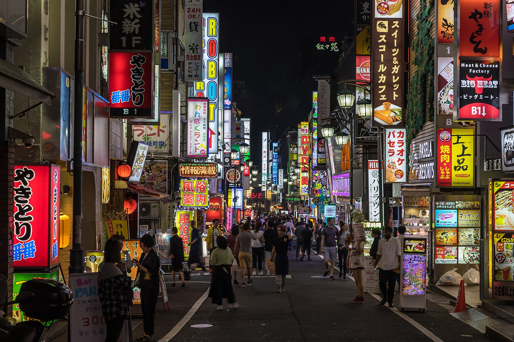 | 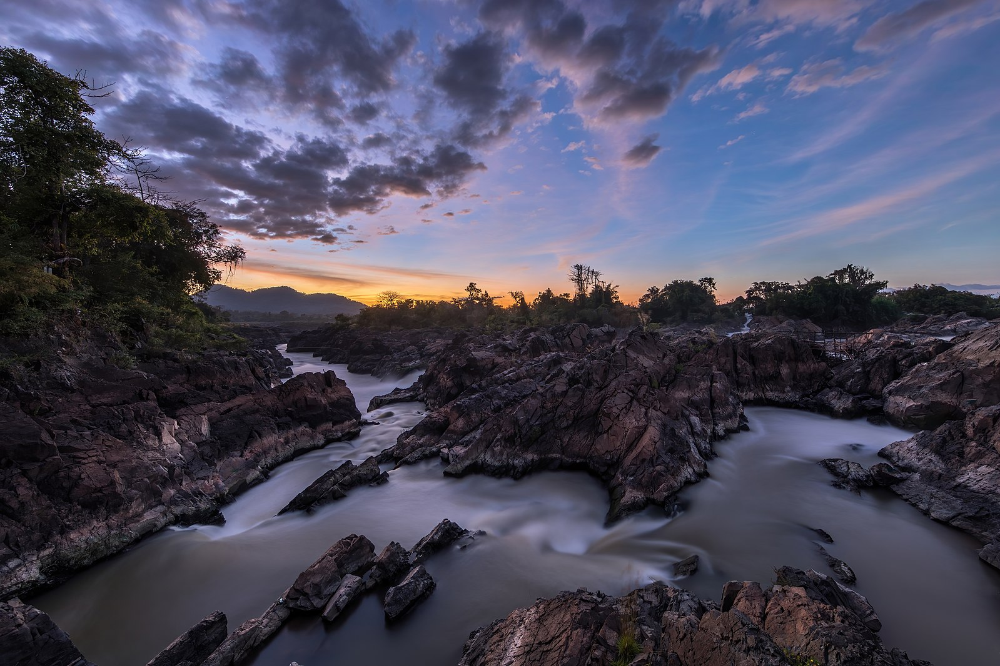 | 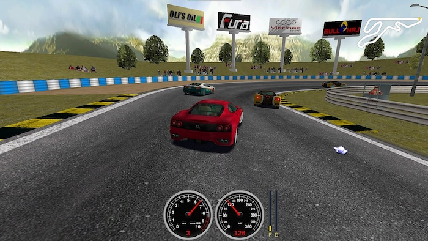  |
| 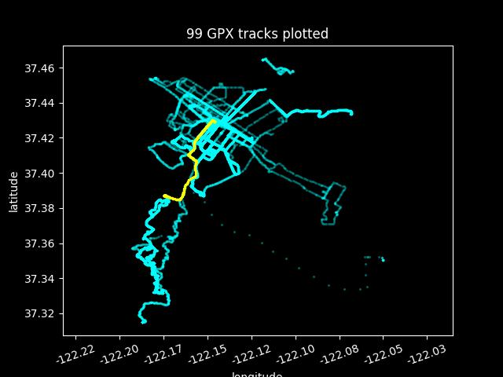 | 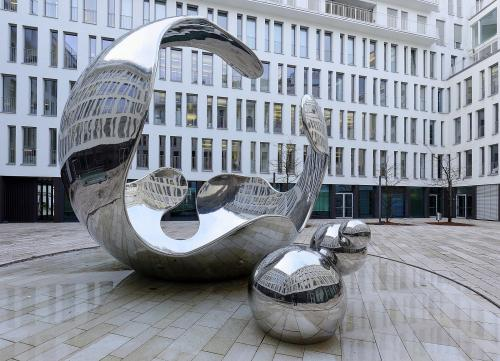 | 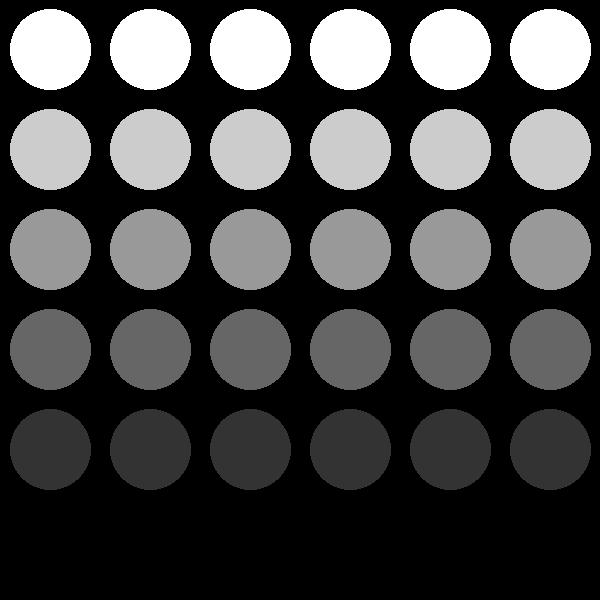| 
| 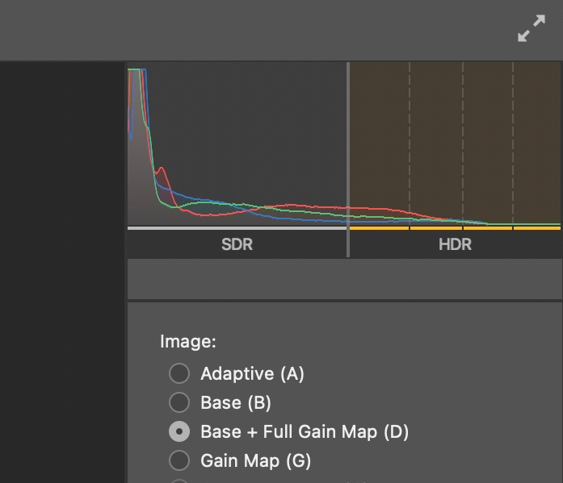 | 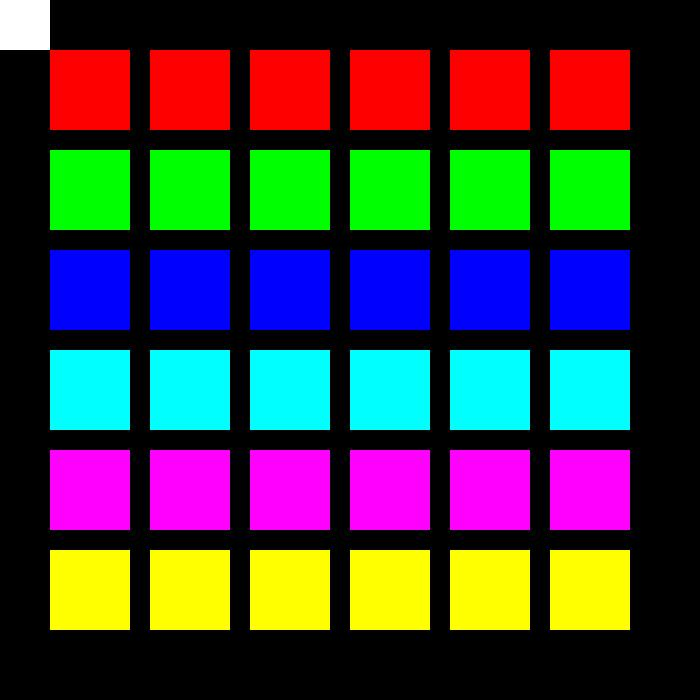 | 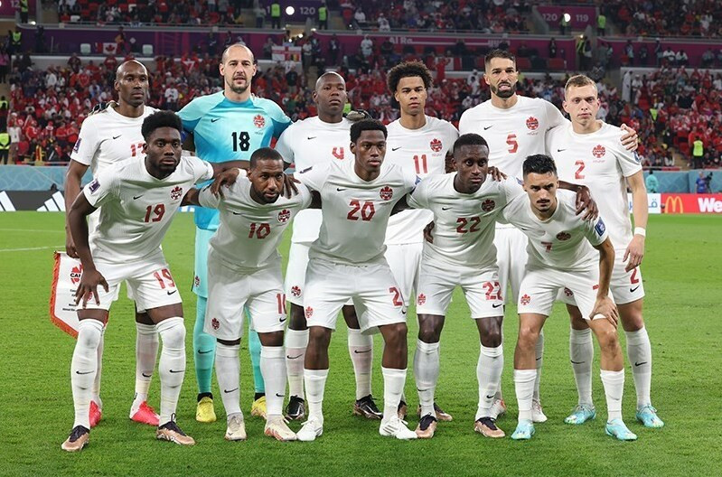 | 

There is also a multi-page Streamlit app (that includes an HDR color picker) available for in-person demonstration. A SDR (ie non-gain mapped) screenshot jpg of this application is below. For comparison, a gain mapped version of this astronomy image is [here](images/gain_mapped-photo-laser_milky_way.jpg) :

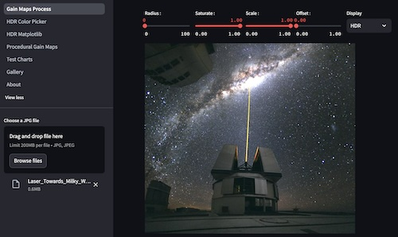

The resulting gain mapped JPGs have been validated using a MacBook Pro M3 (Sonoma 14.6.1) display and the Brave Browser (1.76.73). The Streamlit [dark mode](https://docs.streamlit.io/develop/concepts/configuration/theming) is used for the demo app and a comparable viewing condition may be preferred when viewing the example gain mapped jpegs.

---

* [Convert HDR files to Gain Map HDR](https://github.com/chemharuka/toGainMapHDR) : A tool to convert HDR file to Adaptive HDR (Gain Map HDR) and ISO HDR format in HEIC
* [Gain-MLP: Improving HDR Gain Map Encoding via a Lightweight MLP](https://arxiv.org/html/2503.11883v1)
  * [T. Canham](https://github.com/trevorcanham), [S. Tedla](https://github.com/tedlasai), [M.J. Murdoch](https://www.rit.edu/directory/mmpocs-michael-murdoch), [M.S. Brown](http://www.cse.yorku.ca/~mbrown/) - March 2025
  * "The proposed MLP network architecture. Given the SDR image’s pixel coordinates and RGB values, the network encodes each pixel in a 120-element sine embedding, which is then passed to a two-layer MLP, whose weights are optimized to predict the corresponding gain or gamma map values at each pixel."
* [ISO HDR Images Test Sets (22028-5, 21496-1)
](https://www.imaging.org/IST/IST/Standards/ISO%20HDR%20Images%20Test%20Sets.aspx)
  * These free images test sets are licensed under the CC BY-NC 4.0 license.
  * 1 - **ISO_22028-5_HDR_PQ_4.93** : contains 24 ISO TS 22028-5 PQ images, with up to 4.93x headroom
  * 2 - **ISO_21496-1_Adaptive_HDR_4.93** : contains 24 Adaptive HDR images, with up to 4.93x headroom
  * 3 - **ISO_22028-5_HDR_PQ_Metadata** : contains 23 ISO TS 22028-5 PQ images, with no headroom constraints, and with appropriate metadata
  * 4 - **ISO_21496-1_Adaptive_HDR** : contains 23 Adaptive HDR images, with no headroom constraints
* [How to work with HEIC image file types in Python](https://stackoverflow.com/questions/54395735/how-to-work-with-heic-image-file-types-in-python)
  * [pillow-heif](https://github.com/bigcat88/pillow_heif) : Python library for working with HEIF images and plugin for Pillow.
* [ISO/TS 22028-5:2023(en)](https://www.iso.org/obp/ui/en/#iso:std:iso:ts:22028:-5:ed-1:v1:en) : Photography and graphic technology — Extended colour encodings for digital image storage, manipulation and interchange — Part 5: High dynamic range and wide colour gamut encoding for still images (HDR/WCG)
* [Proposal: gain maps for PNG #380](https://github.com/w3c/png/issues/380)
* [ICC HDR Stills Expert Day : 2024](https://www.color.org/events/hdr/tokyo2024_expert_day/HDRexperts-Tokyo2024.pdf)
  * [ICC HDR Experts' Day : 2022](https://www.color.org/events/HDR_experts.xalter)
* [DCI-P3](https://en.wikipedia.org/wiki/DCI-P3) : DCI-P3 is a color space defined in 2005 as part of the Digital Cinema Initiative, for use in theatrical digital motion picture distribution[1] (DCDM[2]). Display P3 is a variant developed by Apple Inc. for wide-gamut displays.
  * [How to start designing assets in Display P3](https://developer.apple.com/news/?id=5cda5ipr)
* Other Awesome lists
  * [Paper List | High Dynamic Range Imaging](https://github.com/rebeccaeexu/Awesome-High-Dynamic-Range-Imaging) : lists many papers and recent models
  * [Awesome-Deep-HDR](https://github.com/vinthony/awesome-deep-hdr) : A collection of deep learning based methods for HDR image synthesis
* ICtCp color space : Dolby
  * [ICtCp](https://en.wikipedia.org/wiki/ICtCp) : a color representation format specified in the Rec. ITU-R BT.2100 standard that is used as a part of the color image pipeline in video and digital photography systems for high dynamic range (HDR) and wide color gamut (WCG) imagery.[1] It was developed by Dolby Laboratories[2] from the IPT color space by Ebner and Fairchild.
  * [ICtCp - Dolby Whitepaper](https://professional.dolby.com/siteassets/pdfs/ictcp_dolbywhitepaper_v071.pdf)
* [Rec. 2020](https://en.wikipedia.org/wiki/Rec._2020)
* [Rec. 2100](https://en.wikipedia.org/wiki/Rec._2100)
* CIC 2018 Paper : **Assessing Color Discernibility in HDR Imaging using Adaptation Hulls** 
* SMPTE 2017 Conference :  **Hitting the Mark - A New Color Difference Metric for HDR and WCG Imagery** 
* [Coding-independent code points](https://en.wikipedia.org/wiki/Coding-independent_code_points) :  a way to signal the properties of a video or audio stream.[1][2] It can describe the color profile of videos (and still images) in a simpler way than the use of ICC profiles.[3]
* [EI 2023 Plenary 2: Embedded Gain Maps for Adaptive Display of High Dynamic Range Images](https://www.youtube.com/watch?v=HBVBLV9KZNI)
* More papers
  * [Black Level Visibility as a Function of Ambient Illumination](https://hpaonline.com/wp-content/uploads/2018/09/Daly-posted-Black-Level-Visibility-HPA-2018.pdf)
  * [Achieving and Maintaining Perceptual Intent with HDR Imaging](https://sid.onlinelibrary.wiley.com/doi/full/10.1002/msid.1005)
  * [Gamut Rings: A New Method of Representing Color Gamut](https://www.nhk.or.jp/strl/english/publica/giken_dayori/205/1.html)
  * [Gamut Rings are the future for display color evaluation](https://www.laserfocusworld.com/test-measurement/article/55127259/gamut-rings-are-the-future-for-display-color-evaluation)
* [Advanced High Dynamic Range Imaging](https://booksinc.net/book/9781032242736) by Francesco Banterle, Alessandro Artusi, Kurt DeBattista (2021)
  * [HDR_Toolbox](https://github.com/banterle/HDR_Toolbox) : HDR Toolbox for processing High Dynamic Range (HDR) images into MATLAB and Octave
  * [GNU Octave](https://octave.org) : The Octave syntax is largely compatible with Matlab. The Octave interpreter can be run in GUI mode, as a console, or invoked as part of a shell script.
  * [Francesco Banterle](http://www.banterle.com/francesco/) : Home Page and on [github](https://github.com/banterle)
* [PICCANTE](https://github.com/cnr-isti-vclab/piccante) : High Dynamic Range (HDR) Library
* [Dolby Vision to HDR10, SDR, and HLG Video Converter](https://github.com/SASUKE-DUCK/dovi-to-hdr-converter)
* [HDRutils](https://pypi.org/project/HDRutils/) : Some utility functions to generate HDR images from a sequence of exposure time or gain modulated images
* HDR 10
  * [HDR10, is an open high-dynamic-range video (HDR) standard](https://en.wikipedia.org/wiki/HDR10) announced in 2015
* HDR 10+
  * [About HDR10+ technology](https://hdr10plus.org)
* [Ultra HDR Image Format v1.1](https://developer.android.com/media/platform/hdr-image-format)
  * [SkJpegGainmapEncoder.cpp](https://skia.googlesource.com/skia/+/a453fed07c91/src/encode/SkJpegGainmapEncoder.cpp)
  * [ISO 21496-1 gainmap support](https://issues.chromium.org/issues/338342146)
  * [SkAndroidCodec: Add gainmap image decoding support](https://issues.skia.org/issues/40045111)
  * [google/libultrahdr](https://github.com/google/libultrahdr)
  * [imagecodecs](https://pypi.org/project/imagecodecs/) library for image format decode / encode, including libultrahdr (1.3.0)
* [Playing around with Ultra HDR](https://www.reddit.com/r/Python/comments/1ac8ooy/playing_around_with_ultra_hdr/?rdt=40064) and [ths code](https://github.com/albertz/playground/blob/master/ultrahdr.py), also uses ffmpeg
* [I know PNG can handle and contain HD colors, but can it contain HDR colors? ](https://forum.doom9.org/showthread.php?p=2010055)
* [rawpy](https://pypi.org/project/rawpy/) : an easy-to-use Python wrapper for the LibRaw library.
* [AppleJPEGGainMap](https://github.com/grapeot/AppleJPEGGainMap/tree/master) : Generating JPG + Gain Map HDR Photos Compatible with iPhones/Macs Photos
* [Gain Maps](https://helpx.adobe.com/content/dam/help/en/camera-raw/using/gain-map/jcr_content/root/content/flex/items/position/position-par/table/row-3u03dx0-column-4a63daf/download_section/download-1/Gain_Map_1_0d15.pdf) by Eric Chan at Adobe
  * [Gain Map : Adobe ](https://helpx.adobe.com/camera-raw/using/gain-map.html)
  * [Mac Demo App](https://www.adobe.com/go/gainmap_demoapp_mac) and corresponding [documentation](https://helpx.adobe.com/content/dam/help/en/camera-raw/using/gain-map/jcr_content/root/content/flex/items/position/position-par/table/row-io13dug-column-4a63daf/download_section/download-1/gain_map_demo_appdocs1.pdf)
  * [Gain Map Sample Photos](https://www.adobe.com/go/gainmap_sample_photos)
* JPEG-XL
  * [pillow-jxl-plugin](https://pypi.org/project/pillow-jxl-plugin/)
  * [jxlpy](https://pypi.org/project/jxlpy/)
  * [How does HDR in JXL work?](https://www.reddit.com/r/jpegxl/comments/1c04fh5/how_does_hdr_in_jxl_work/?rdt=46406)
* ACES
  * [Academy Color Encoding System Core Transforms](https://github.com/ampas/aces-core)
  * [OpenColorIO Configuration for ACES](https://github.com/AcademySoftwareFoundation/OpenColorIO-Config-ACES)
  * [ACES Central](https://community.acescentral.com)
  * [Why Every Editor, Colorist, and VFX Artist Needs to Understand ACES](https://blog.frame.io/2019/09/09/guide-to-aces/)
* [Applying Apple HDR effect to your photos](https://developer.apple.com/documentation/appkit/images_and_pdf/applying_apple_hdr_effect_to_your_photos) : You can decode and apply Apple’s HDR gain map to your own images.
* [Gain Map - discussion thread](https://gist.github.com/kiding/fa4876ab4ddc797e3f18c71b3c2eeb3a)
* [High Dynamic Range color grading and display in Frostbite](https://www.slideshare.net/slideshow/high-dynamic-range-color-grading-and-display-in-frostbite/72997674) : slides
* [The high dynamic range imaging pipeline:](https://www.diva-portal.org/smash/get/diva2:1206025/FULLTEXT01.pdf) Tone-mapping, distribution, and single-exposure reconstruction, by Gabriel Eilertsen (2018)
* [ColorAide](https://github.com/facelessuser/coloraide?tab=readme-ov-file) : A library to aid in using colors . . . about [ICtCp](https://facelessuser.github.io/coloraide/colors/ictcp/#)
* [Greg Benz Photography : HDR JPG Gain Map Gallery](https://gregbenzphotography.com/hdr-gain-map-gallery/)
* Use [Brave browser](https://en.wikipedia.org/wiki/Brave_(web_browser)) to view JPEGs with gain maps
* [gainmap-js](https://github.com/MONOGRID/gainmap-js) : A Javascript (TypeScript) Encoder/Decoder Implementation of Adobe's Gain Map Technology for storing HDR Images using an SDR Image + a "Gain map"
  * [A free and open source tool for converting HDR and EXR files to the Adobe Gain map (AKA Ultra HDR) format](https://gainmap-creator.monogrid.com)
* [How to convert JPG images to AVIF with Python](https://stackoverflow.com/questions/69566052/how-to-convert-jpg-images-to-avif-with-python)
* [darktable]( ) : an open source photography workflow application and raw developer.
  * [Extensible Metadata Platform - XMP](https://en.wikipedia.org/wiki/Extensible_Metadata_Platform) : save specific sequence of image edits
* [OpenEXR : Test Images](https://openexr.com/en/latest/test_images/index.html)
  * [OpenEXR - Python Module](https://openexr.com/en/latest/python.html)
* [NEF Format](https://www.nikonusa.com/learn-and-explore/c/products-and-innovation/nikon-electronic-format-nef) : Nikon Electronic Format (NEF)
* pixls.us : [Play Raw category](https://discuss.pixls.us/c/processing/playraw/30) . . . such as
  * [A little snow to play with](https://discuss.pixls.us/t/a-little-snow-to-play-with/46687)
* [CR2](https://en.wikipedia.org/wiki/Raw_image_format) : Canon Raw v2 (CR2) . . . Canon 5D camera
* [ISET/isetcam](https://github.com/ISET/isetcam) . . . (notes w Octave?)
* [A most unusual brightness](https://chsmc.org/2024/10/unusual-brightness/) : "The illustrations for Digital Divinity make use of this effect in a brilliant (literally) way by masking a pure white, HDR video such that parts of the illustration glow with an ethereal brightness."
* [Inverse Tone Mapping - Upscaling SDR Content to HDR](https://professionalsupport.dolby.com/s/article/Inverse-tone-mapping-upscaling-SDR-content-to-HDR?language=en_US)
* [Welcome to the wide-gamut test page](https://www.wide-gamut.com/test)
* [dtinth/superwhite](https://github.com/dtinth/superwhite)
  * "display a very bright white color on HDR-enabled displays with ~1 KB of video file"
  * it really is quite bright
* [Perceptually uniform color space for image signals including high dynamic range and wide gamut](https://opg.optica.org/oe/fulltext.cfm?uri=oe-25-13-15131&id=368272)
* [Visualizing Errors in Rendered High Dynamic Range Images](https://research.nvidia.com/publication/2021-05_visualizing-errors-rendered-high-dynamic-range-images)
* [HDR Merge](https://support.captureone.com/hc/en-us/articles/8861073819165-HDR-Merge) : "Get increased dynamic range in your photos by merging your bracketed RAW files directly within Capture One. The result is a linear DNG that behaves like a RAW file for further editing."
* [Color Grading & Finishing : How to - Add a LUT in Avid Media Composer](https://www.johndaro.com/blog/tag/HDR)
* [Exposure Fusion – local tonemapping for real-time rendering](https://bartwronski.com/2022/02/28/exposure-fusion-local-tonemapping-for-real-time-rendering/)
* [HDR NITS ARE A LIE: IT’S TIME TO EMBRACE THE STOP](https://www.archivalworks.com/blog/hdr-nits-are-a-lie-embrace-the-stop)
* [Adventures in EDR, Part 1: Displaying EDR Photos in iOS 17](https://rioogino.com/posts/2024/edr_1_photos/) and [Adventures in EDR, Part 2: Metal](https://rioogino.com/posts/2024/edr_2_metal/)
* [How Could I extract MPF images (HDR gain Map) from iPhone's jpegs?](https://exiftool.org/forum/index.php?topic=11747.0)
  * [brew install exiftool](https://formulae.brew.sh/formula/exiftool)
  * ```exiftool -b -MPImage2 image_w_gain_map.jpg > gain_map.jpg```
  * [Using ExifTool to modify metadata](http://fui.sdf.org/technotes/Exiftool.html)
* [OpenCV : High Dynamic Range Imaging](https://docs.opencv.org/4.x/d3/db7/tutorial_hdr_imaging.html) : tonemapped and with exposure fusion
* [Reading/writing JPEG MPF (Multi-Picture Format) files](https://discuss.pixls.us/t/reading-writing-jpeg-mpf-multi-picture-format-files/37610)
* [High Dynamic Range Imaging - Exposure sequence & Exposure fusion](https://docs.opencv.org/4.x/d3/db7/tutorial_hdr_imaging.html) - EXPOSURE FUSION
  * [Splitting OpenEXR into different exposure images](https://stackoverflow.com/questions/58740992/splitting-openexr-into-different-exposure-images)
  * [Exposure Fusion](https://en.wikipedia.org/wiki/Exposure_fusion) and [tone mapping](https://en.wikipedia.org/wiki/Tone_mapping)
* [Manual creation of UltraHDR images](https://discuss.pixls.us/t/manual-creation-of-ultrahdr-images/45004/10) : discussion thread
* [Day-to-Night Image Synthesis for Training Nighttime Neural ISPs](https://github.com/SamsungLabs/day-to-night) : CVPR'22 Oral
  * [SamsungLabs](https://github.com/SamsungLabs)
* [HEIC Image Processing Tools](https://github.com/finnschi/heic-shenanigans) - heic-shenanigans
* [Gamma Maps: Non-linear Gain Maps for HDR Reconstruction](https://www.researchgate.net/profile/Trevor-Canham/publication/383212599_Gamma_Maps_Non-linear_Gain_Maps_for_HDR_Reconstruction/links/66c21e922ff54d6c9edba842/Gamma-Maps-Non-linear-Gain-Maps-for-HDR-Reconstruction.pdf)
* [Improving-Color-Space-Conversion-for-Camera-Captured-Images-via-Wide-Gamut-Metadata](https://github.com/hminle/improving-color-space-conversion-via-metadata?tab=readme-ov-file)
* [Monochrome vs Color Gain Map Examples](https://people.csail.mit.edu/ericchan/hdr/mono-gain-map.html) : from the website of [Eric Chan](https://people.csail.mit.edu/ericchan/)
* [American Science & Surplus is fighting for its life. Here’s why you should care.](https://arstechnica.com/gadgets/2025/06/american-science-surplus-is-fighting-for-its-life-heres-why-you-should-care/?comments-page=1#comments) - neat place, nice gain mapped photos
* [The iPhone 15 Pro's Depth Maps](https://tech.marksblogg.com/apple-iphone-15-pro-depth-map-heic.html) : and the gain maps
* [Learning Gain Map for Inverse Tone Mapping](https://github.com/qtlark/GMNet) - ICLR2025
  
---

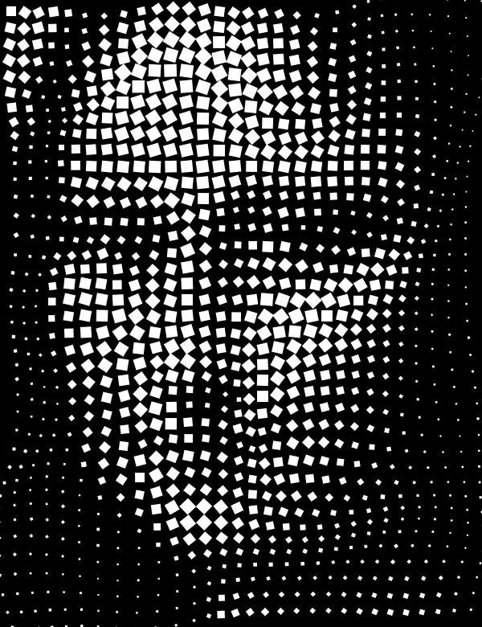

*Procedurally generated gain mapped jpeg* : motivated by [#genuary](https://genuary.art)
