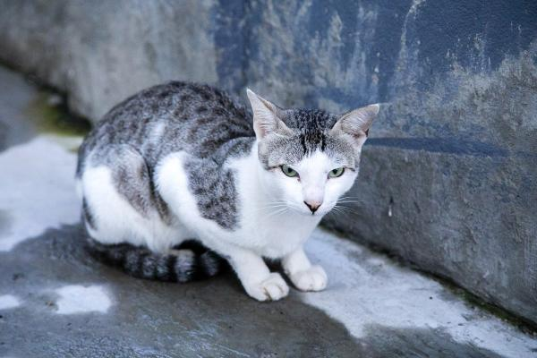
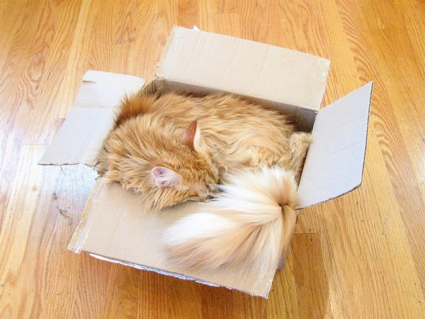
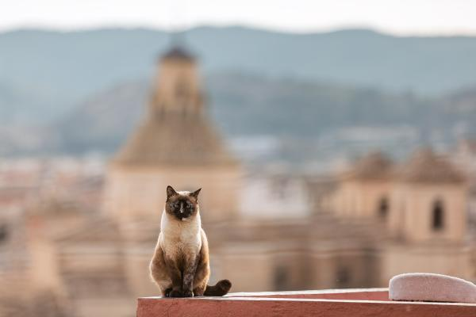
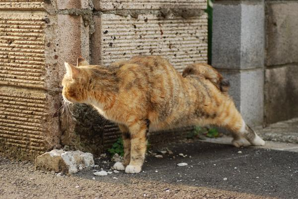
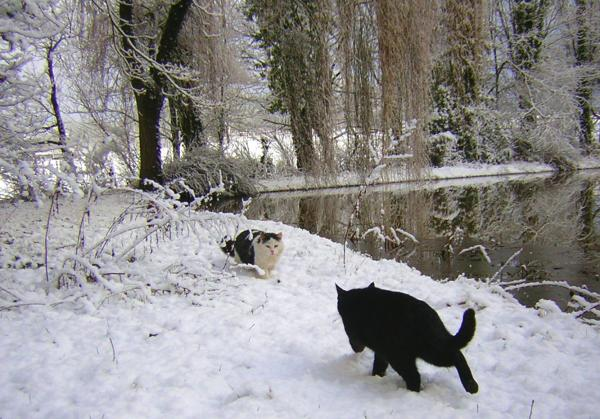
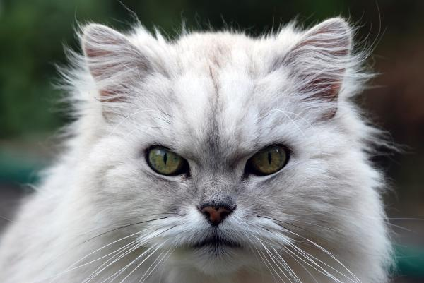
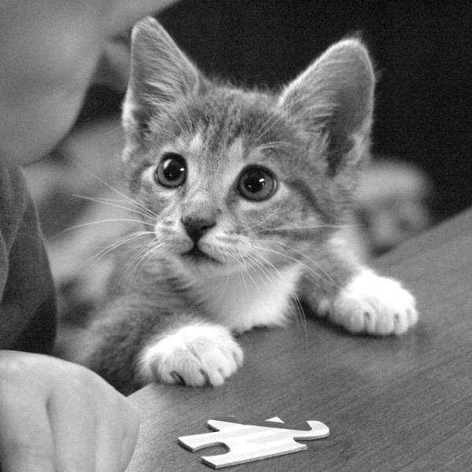

## Awesome-Gain-Maps : Cats

Cats are great HDR test content. 

Fur and whiskers provide high frequency details.

Depending on the scene they can have a lot of contrast (backlit, snow) or low contrast (dim illumination).

The gain-mapped versions below were generated with a streamlit demo app.

Please reference the attribution column for photographers and image license.

---

| Image | Attribution |
| --- | --- |
|  | [Юрий Д.К.](https://commons.wikimedia.org/wiki/File:Cat_(44744745484).jpg) |
|  | [Abujoy](https://commons.wikimedia.org/wiki/File:12_cats_eating_together_around_a_centrally_placed_lamp_in_cat_cafe.jpg) |
|  | [Exabyterra](https://commons.wikimedia.org/wiki/File:Cat_Sergio_fooling_around.jpg) | 
|  | [Bijay Chaurasia](https://commons.wikimedia.org/wiki/File:Cat_in_Kathmandu,_Nepal-070A3190.jpg) |
|  | [哲学的ゾンビ](https://commons.wikimedia.org/wiki/File:Cat_liquid.jpg) |
|  | [Ximonic](https://commons.wikimedia.org/wiki/File:Cat_sitting_on_a_balcony_at_Castillo_de_Caravaca_de_la_Cruz_in_Caravaca_de_la_Cruz,_Noroeste,_Murcia,_Spain,_2025_February_-_2.jpg) |
|  | [WC-QHS](https://commons.wikimedia.org/wiki/File:Cats_2010-04-06_14.jpg) |
|  | [Magnus Manske](https://commons.wikimedia.org/wiki/File:Cats_dual_on_the_snowy_ground-01-Zenera.jpg) |
|  | [Russavia](https://commons.wikimedia.org/wiki/File:Chinchilla_cat_(5833713404).jpg) |
|  | [Watchduck](https://commons.wikimedia.org/wiki/File:Kitten_with_paws_on_table_(square).jpg) |
