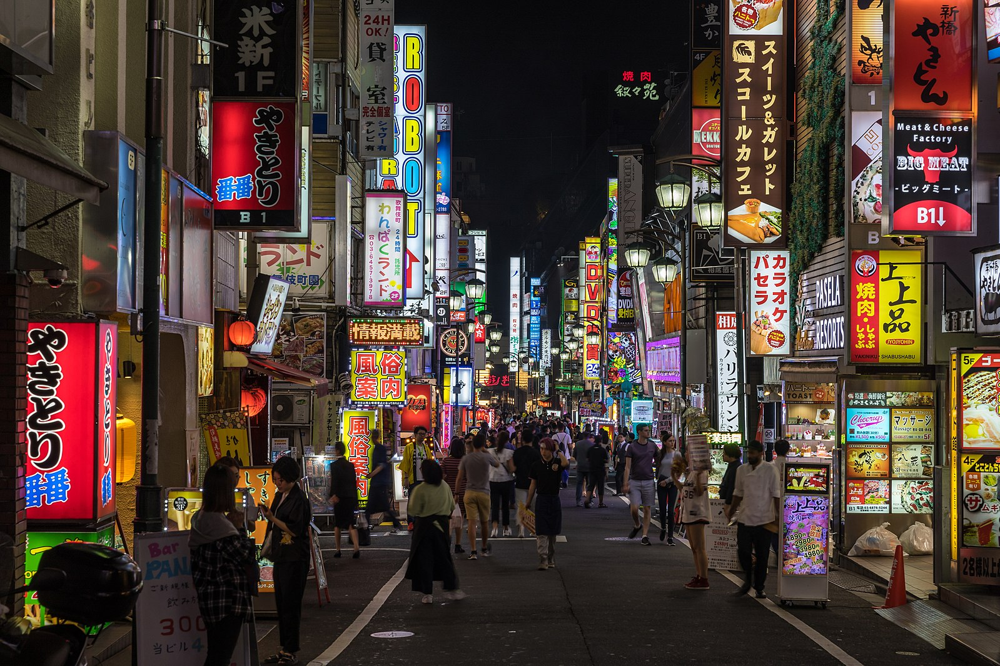

## Gain Mapped JPGs

A collection of gain mapped jpeg files. 

*Image attribution* : [Basile Morin](https://commons.wikimedia.org/wiki/File:Colorful_neon_street_signs_in_Kabukichō,_Shinjuku,_Tokyo.jpg)

All of the gain mapped images, except rgba_uhdr.jpg and rgba_uhdr.jpg, were generated by the author of this repository.

Intention is a breadth of sampling of different content and domains of use.

Test viewing of all images :

| laptop | OS | Browser |
| --- | --- | --- |
| MacBook Pro M3 | Sonoma 14.6.1 | Brave (1.76.73) |

---

The table below provides list with corresponding attributions.

Attribution's to [NMoroney](https://github.com/NMoroney) are licensed under the [Creative Commons](https://en.wikipedia.org/wiki/en:Creative_Commons) [Attribution 4.0 International license](https://creativecommons.org/licenses/by/4.0/deed.en).

| Image | Atrribution | 
| --- | --- |
| gain_mapped-medical-z-line-0a6bdc13-99b5-4287-8380-b469e7a397cf.jpg | [Kvasir](https://datasets.simula.no/kvasir/) | 
| gain_mapped-photo-airborne_by_christopher_klein.jpg | [Martin Falbisoner](https://commons.wikimedia.org/wiki/File:Airborne_by_Christopher_Klein,_Munich,_February_2017_-2.jpg) | 
| gain_mapped-photo-canada_national_football_team_wc2022.jpg | [Hossein Zohrevand](https://commons.wikimedia.org/wiki/File:Canada_national_football_team_WC2022.jpg) | 
| gain_mapped-photo-colorful_daisies.jpg | [Kaz Andrew](https://commons.wikimedia.org/wiki/File:Colorful_Crazy_Daisies_(1)_(2530872878).jpg) | 
| gain_mapped-photo-laser_milky_way.jpg | [ESO/Yuri Beletsky](https://commons.wikimedia.org/wiki/File:Laser_Towards_Milky_Ways_Centre.jpg) | 
| gain_mapped-photo-phi_falls.jpg | [Basile Morin](https://commons.wikimedia.org/wiki/File:Li_Phi_falls_at_dusk_with_colorful_sky_and_clouds_in_Don_Khon_Laos.jpg) |
| gain_mapped-photo-tokyo.jpg | [Basile Morin](https://commons.wikimedia.org/wiki/File:Colorful_neon_street_signs_in_Kabukichō,_Shinjuku,_Tokyo.jpg) | 
| gain_mapped-procedural_art-square_flows_mona_lisa.jpg | [NMoroney](https://github.com/NMoroney) | 
| gain_mapped-test_chart-color_01.jpg | [NMoroney](https://github.com/NMoroney) | 
| gain_mapped-test_chart-color_02.jpg | [NMoroney](https://github.com/NMoroney) | 
| gain_mapped-test_chart-gray_51.jpg | [NMoroney](https://github.com/NMoroney) | 
| gain_mapped-test_chart-squares_b4_gm2.jpg | [NMoroney](https://github.com/NMoroney) | 
| gain_mapped-text-sphinx_01.jpg | [NMoroney](https://github.com/NMoroney) | 
| gain_mapped-ui-demo_app.jpg | [Gain Map Demo App](https://www.adobe.com/go/gainmap_demoapp_mac) | 
| gain_mapped-video_games-guacamelee.jpg | [DrinkBox Studios](https://commons.wikimedia.org/wiki/File:Guacamelee!_screenshot_J.jpg) | 
| gain_mapped-video_games-nexuiz.jpg | [Bayo](https://commons.wikimedia.org/wiki/File:Nexuiz_-_screenshot_8.jpg) | 
| gain_mapped-video_games-speed_dreams.jpg | [Antimundo](https://commons.wikimedia.org/wiki/File:Speed-dreams-2.4.0-screenshot-multiplecars.jpg) | 
| gain_mapped-video_games-warsow.jpg | [Chasseur De Bots](https://commons.wikimedia.org/wiki/File:Warsow_Screenshot_1.0_1.jpg) | 
| gain_mapped-visualization-3d_scatterplot.jpg | [NMoroney](https://github.com/NMoroney) | 
| gain_mapped-visualization-matplotlib_gpx.jpg | [NMoroney](https://github.com/NMoroney) | 
| rgba.uhdr | [libultrahdr](https://github.com/google/libultrahdr) | 
| rgba_uhdr.jpg | [libultrahdr](https://github.com/google/libultrahdr) | 

